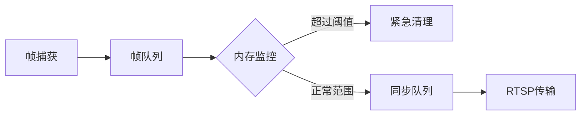
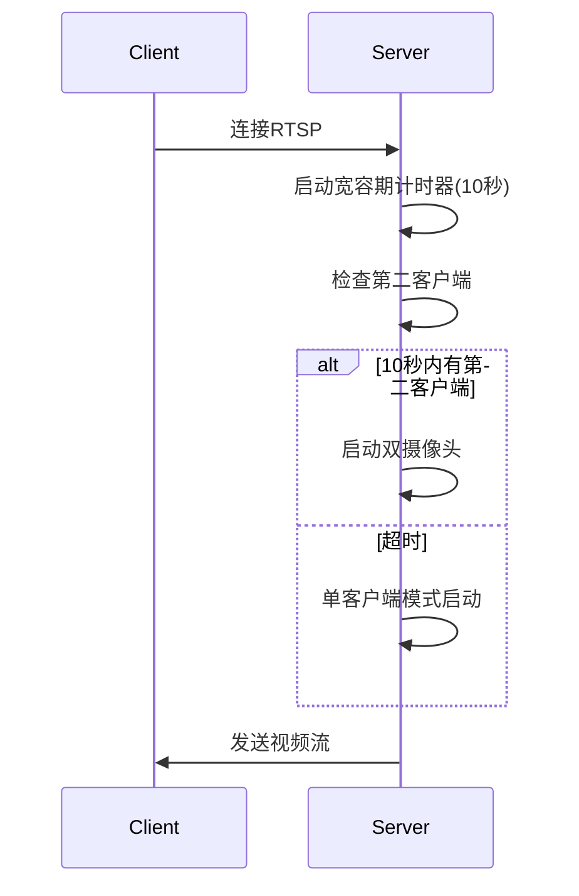

# 双摄像头同步捕获与RTSP流媒体系统

## 项目概述
本系统实现了一个高效的双USB摄像头同步捕获与RTSP流媒体解决方案。核心功能包括：
- 双摄像头硬件同步初始化
- 基于时间戳的帧级同步
- 低延迟RTSP流媒体传输
- 智能内存管理与监控
- 客户端连接状态管理

## 技术栈与库
- **GStreamer**：用于RTSP流媒体传输
  - appsrc：自定义数据源
  - x264enc：H.264编码
  - rtph264pay：RTP封装
- **FFmpeg**：用于视频捕获和帧处理
  - libavcodec：视频解码
  - libavformat：设备输入
  - libswscale：像素格式转换
- **C++14特性**：
  - 多线程(std::thread)
  - 原子操作(std::atomic)
  - 智能指针(std::shared_ptr)
- **系统级优化**：
  - 内存监控与紧急清理
  - 零拷贝帧传输
  - 低延迟配置

## 架构与组件

### 核心组件
1. **DualCameraCapture (sync_camera.cpp/h)**
   - 负责摄像头初始化、帧捕获和同步
   - 实现YUV420P帧转换
   - 基于时间戳的多摄像头帧同步
   - 新增内存监控和紧急清理机制

2. **视频流传输器 (video_streamer.cpp/h)**
   - 使用GStreamer实现RTSP流传输
   - 将YUV420P帧编码为H.264流
   - 实现客户端连接状态管理
   - 支持PTS(显示时间戳)动态重置

### 线程模型
1. **主线程**：系统初始化和状态监控
2. **摄像头捕获线程**：每个摄像头独立线程(共2个)
3. **帧同步线程**：匹配双摄像头时间戳
4. **RTSP服务线程**：GStreamer主循环
5. **帧推送线程**：向GStreamer管道喂数据

### 内存管理系统


## 工作流程

### 初始化序列
1. 创建`DualCameraCapture`实例并初始化双摄像头
2. 创建两个`VideoStreamer`实例(RTSP服务器)
3. 启动所有工作线程

### 数据流
1. **捕获阶段**：
   - 摄像头线程通过FFmpeg捕获原始帧
   - 转换为YUV420P格式并添加时间戳
   - 帧存入带时间戳的队列

2. **同步阶段**：
   - 同步线程比较双摄像头帧时间戳
   - 时间戳差异<100μs的帧配对为同步帧
   - 同步帧送入传输队列

3. **流传输阶段**：
   - 检查客户端连接状态
   - 动态重置新客户端的PTS
   - 通过GStreamer管道编码为H.264
   - 通过RTP/RTSP传输

## 智能客户端管理
- **宽容期机制**：首客户端连接后等待10秒让第二客户端加入
- **PTS重置**：新客户端连接时重置时间戳序列
- **连接状态回调**：实时通知连接变化


## 内存管理
- **全局跟踪**：
  ```cpp
  std::atomic<size_t> g_total_frames_allocated{0};
  std::atomic<size_t> g_total_frames_freed{0};
  std::atomic<size_t> g_active_frame_count{0};
  ```
- **紧急清理**：
  ```cpp
  size_t emergency_memory_cleanup() {
    // 保留最新2帧，清理旧帧
  }
  ```
- **队列平衡**：
  ```cpp
  size_t balance_frame_queues() {
    // 防止单个队列帧数超标
  }
  ```

## 构建与运行
### 依赖项
- FFmpeg 4.4+
- GStreamer 1.18+
- C++14兼容编译器

### 编译命令
```bash
g++ -std=c++14 main.cpp sync_camera.cpp video_streamer.cpp \
    -o dual_cam_streamer \
    $(pkg-config --cflags --libs libavcodec libavformat libswscale gstreamer-1.0)
```

### 运行
```bash
./dual_cam_streamer
```

### 测试命令
```bash
# 左摄像头流
ffplay -rtsp_transport tcp -fflags nobuffer -flags low_delay rtsp://192.168.16.247:5004/stream

# 右摄像头流
ffplay -rtsp_transport tcp -fflags nobuffer -flags low_delay rtsp://192.168.16.247:5006/stream
```

## 系统监控
运行时控制台显示关键指标：
```
[STATUS] Runtime: 5min, Memory: 45MB (peak: 89MB)
[CAMERA] Pairs sent: 8500 (success: 8490, fail: 10)
[QUEUE] Active frames: 12, Sync queue: 2
```

## 故障处理
1. **高内存使用**：
   - 系统自动触发紧急清理
   - 手动发送SIGTERM信号安全重启

2. **客户端断连**：
   - 自动暂停摄像头捕获
   - 保持低内存占用待机状态

3. **同步失败**：
   - 自动丢弃无法匹配的帧
   - 动态调整同步阈值
```
