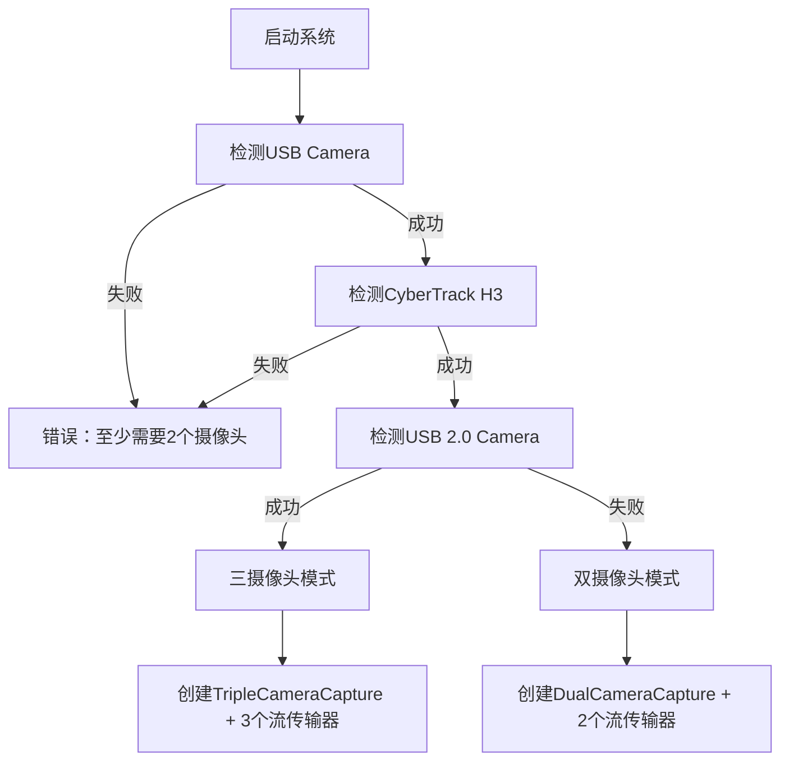

# 自适应多摄像头同步采集与流传输系统

## 项目概述
本项目实现了一个高效的**自适应多摄像头同步采集与多协议流传输解决方案**。系统能够自动检测2-3个USB摄像头并选择最佳同步策略。核心功能包括：

- **自适应摄像头检测**：自动识别2个或3个摄像头配置
- **智能同步策略**：双摄像头30fps高质量同步 / 三摄像头20fps插值同步
- **帧插值技术**：低帧率摄像头的时间连续性优化
- **多协议传输支持**：TCP原始数据流 + RTSP编码流（可选）
- **智能内存管理**：动态监控与紧急清理机制
- **即插即用**：零配置自动适应不同摄像头组合

## 🎯 工作模式

### 模式1：双摄像头高质量同步
**摄像头配置**：`USB Camera` + `CyberTrack H3`
- **同步帧率**：~30 FPS
- **数据质量**：100%真实帧，无插值
- **内存使用**：~60MB
- **适用场景**：高质量立体视觉、精确测量

### 模式2：三摄像头全景同步  
**摄像头配置**：`USB Camera` + `CyberTrack H3` + `USB 2.0 Camera`
- **同步帧率**：~20 FPS
- **数据质量**：前两个摄像头100%真实帧 + 第三摄像头50%真实帧+50%插值帧
- **内存使用**：~80MB
- **适用场景**：多角度监控、全景重建

## 传输方案对比

### 🚀 方案一：TCP 原始I420数据流（主要方案）
**适用场景**：本地高性能处理、计算机视觉、低延迟要求
- **编程接口**：TCP Socket + GStreamer
- **数据格式**：原始YUV420P(I420)无损数据
- **带宽需求**：高（~35Mbps@640x480）
- **延迟**：极低（<10ms）
- **客户端支持**：OpenCV、GStreamer应用
- **处理能力**：适合实时图像处理和分析

### 🎯 方案二：RTSP H.264 编码流传输（备选方案）
**适用场景**：网络传输、多客户端、带宽受限环境  
- **编程接口**：标准RTSP协议
- **数据格式**：H.264压缩视频流
- **带宽需求**：低（~2Mbps@640x480）
- **延迟**：中等（50-100ms）
- **客户端支持**：VLC、FFplay、浏览器等
- **多客户端**：支持同时多个客户端连接
- **状态**：代码中已实现但当前注释，可按需启用

## 技术架构

### 核心组件

1. **BaseCameraCapture (sync_camera.h) - 摄像头基类**
   - 定义统一的摄像头接口
   - 支持多态的双/三摄像头实现

2. **DualCameraCapture (sync_camera.cpp) - 双摄像头实现**
   - 专为30fps高质量同步优化
   - MJPEG格式解码，降低USB带宽占用
   - 50ms同步阈值，精确帧匹配

3. **TripleCameraCapture (sync_camera.cpp) - 三摄像头实现**
   - 前两摄像头30fps + 第三摄像头15fps实际采集
   - **线性插值算法**：在真实帧间生成2个插值帧
   - 时间戳精确计算，保持时间连续性
   - 放宽同步阈值适应插值帧

4. **SharedMemoryStreamer (shared_memory_streamer.cpp)**
   - 基于TCP Socket的原始数据传输
   - 自动端口分配（5010, 5011, 5012）
   - 直接传输I420格式无损数据
   - 极低延迟的本地高性能传输

5. **自适应检测系统 (main.cpp)**
   - 启动时自动检测可用摄像头
   - 根据检测结果选择最佳工作模式
   - 动态创建相应的流传输器

### 帧插值技术详解

```cpp
// 第三摄像头插值策略
真实帧时间轴:  0ms    100ms   200ms   300ms
插值时间轴:    0ms 33ms 66ms 100ms 133ms 166ms 200ms
插值权重:     Real  0.33  0.66  Real   0.33   0.66  Real

// 线性像素插值公式
dst_pixel = prev_pixel * (1-t) + next_pixel * t
// t = 0.33 或 0.66，在真实帧间33%和66%位置生成插值帧
```

### 线程模型
- **主线程**：系统初始化和状态监控
- **摄像头采集线程**：每个摄像头独立线程（2-3个）
- **帧同步线程**：匹配多摄像头时间戳
- **插值线程**：第三摄像头帧插值处理（仅三摄像头模式）
- **流传输线程**：处理数据推送到客户端（多个）

## 智能检测与启动流程

### 摄像头检测逻辑


### 自适应启动过程
1. **系统检测**：按优先级逐一测试摄像头可用性
2. **模式决策**：根据检测结果自动选择双/三摄像头模式
3. **资源分配**：创建相应数量的流传输器和端口
4. **智能同步**：启动对应的同步算法和插值处理

## 构建与运行

### 依赖项
- **FFmpeg 4.4+**：摄像头采集和格式转换
- **GStreamer 1.18+**：流传输管道
- **C++14兼容编译器**：现代C++特性支持

### 编译命令
```bash
# 主要TCP版本（自适应模式）
g++ -std=c++14 main.cpp sync_camera.cpp shared_memory_streamer.cpp \
    -o sync_camera \
    $(pkg-config --cflags --libs libavcodec libavformat libswscale libavdevice gstreamer-1.0) \
    -pthread

# 可选RTSP版本（需要解除注释）
g++ -std=c++14 main-rtsp.cpp sync_camera.cpp video_streamer.cpp \
    -o dual_cam_rtsp \
    $(pkg-config --cflags --libs libavcodec libavformat libswscale gstreamer-1.0 gstreamer-rtsp-server-1.0) \
    -pthread
```

### 运行示例
```bash
# 启动自适应摄像头同步系统
./sync_camera

# 输出示例1：双摄像头模式
# [DETECTION] Mode: Dual Camera Sync (2 cameras detected)
# [SHM] 2 shared memory streamers started successfully!
# Left camera port: 5010
# Right camera port: 5011

# 输出示例2：三摄像头模式  
# [DETECTION] Mode: Triple Camera Sync (3 cameras detected)
# [SHM] 3 shared memory streamers started successfully!
# Left camera port: 5010
# Right camera port: 5011
# Third camera port: 5012
```

## 客户端脚本使用

### 自适应客户端（推荐）
**脚本名称**：`test_consumer.py`（自适应版本）

```python
# 自动检测服务端模式并启动对应客户端
python3 test_consumer.py

# 自定义起始端口
python3 test_consumer.py 5010
```

**功能特点**：
- **自动模式检测**：连接服务端后自动识别双/三摄像头模式
- **自适应界面**：根据模式显示相应的窗口布局
- **双显示模式**：
  - **合并模式**（默认）：所有摄像头在一个窗口中显示
  - **分离模式**：每个摄像头独立窗口显示
- **实时统计**：显示每个摄像头的FPS、帧数、同步质量
- **交互控制**：
  - `c` 键：切换到合并显示模式
  - `s` 键：切换到分离显示模式  
  - `q` 键：退出程序

**显示布局**：
```
双摄像头模式：        三摄像头模式：
┌─────┬─────┐        ┌─────┬─────┐
│Left │Right│        │Left │Right│
└─────┴─────┘        ├─────┴─────┤
                     │   Third   │
                     └───────────┘
```

### 手动客户端示例

**Python + OpenCV 接收原始I420数据**：
```python
import cv2
import numpy as np

# 双摄像头模式
cap_left = cv2.VideoCapture('tcpclientsrc host=127.0.0.1 port=5010 ! videoconvert ! appsink', cv2.CAP_GSTREAMER)
cap_right = cv2.VideoCapture('tcpclientsrc host=127.0.0.1 port=5011 ! videoconvert ! appsink', cv2.CAP_GSTREAMER)

while True:
    ret_l, frame_l = cap_left.read()
    ret_r, frame_r = cap_right.read()
    
    if ret_l and ret_r:
        # 处理同步的双摄像头帧
        cv2.imshow('Left', frame_l)
        cv2.imshow('Right', frame_r)
        
    if cv2.waitKey(1) & 0xFF == ord('q'):
        break
```

**三摄像头模式**：
```python
# 添加第三摄像头
cap_third = cv2.VideoCapture('tcpclientsrc host=127.0.0.1 port=5012 ! videoconvert ! appsink', cv2.CAP_GSTREAMER)

# 在循环中添加
ret_t, frame_t = cap_third.read()
if ret_t:
    cv2.imshow('Third', frame_t)
```

**RTSP方案客户端**（如果启用RTSP版本）：
```bash
# 左摄像头流
ffplay -rtsp_transport tcp -fflags nobuffer -flags low_delay rtsp://localhost:5004/stream

# 右摄像头流  
ffplay -rtsp_transport tcp -fflags nobuffer -flags low_delay rtsp://localhost:5006/stream
```

## 性能监控与统计

### 运行时监控
```
=== 双摄像头模式输出示例 ===
[DUAL SYNC] dual sync - Groups sent: 1800 (success: 1795, fail: 5), FPS: 30.0, Memory: 62MB
[DUAL CAP0][60s] Captured: 1803 frames, Avg FPS: 30.1, Dropped: 8, Queue: 5/10
[DUAL CAP1][60s] Captured: 1798 frames, Avg FPS: 30.0, Dropped: 12, Queue: 4/10

=== 三摄像头模式输出示例 ===  
[TRIPLE SYNC] triple sync - Groups sent: 1220 (success: 1215, fail: 85), FPS: 20.3, Memory: 78MB
[INTERPOLATION] Real frames: 610, Interpolated: 1220, Queue size: 2
[TRIPLE CAP0][60s] Captured: 1804 frames, Avg FPS: 30.1, Dropped: 15
[TRIPLE CAP1][60s] Captured: 1798 frames, Avg FPS: 30.0, Dropped: 18
[TRIPLE CAP2][60s] Captured: 612 frames, Avg FPS: 10.2, Dropped: 0
```

### 客户端性能统计
```
📊 Triple Camera Sync Statistics:
   Runtime: 180.5 seconds
   Left Camera: 3648 frames (20.2 fps)
   Right Camera: 3642 frames (20.2 fps)  
   Third Camera: 3651 frames (20.2 fps)
   Average Sync FPS: 20.2
   Frame Rate Consistency: 0.12 (lower is better)
   ✓ Good triple camera sync performance!
```

## 内存管理与优化

### 智能内存监控
```cpp
// 全局内存跟踪
std::atomic<size_t> g_total_frames_allocated{0};
std::atomic<size_t> g_total_frames_freed{0};
std::atomic<size_t> g_active_frame_count{0};

// 紧急清理机制
if (memory_usage > 200MB) {
    size_t cleared = capture->emergency_memory_cleanup();
    // 保留最新2帧，清理旧帧缓存
}
```

### 队列管理策略
- **双摄像头模式**：每个摄像头队列最大10帧
- **三摄像头模式**：主摄像头10帧，第三摄像头5帧，插值队列20帧
- **同步队列**：最多保留2个同步帧组


## 应用场景与方案选择

### 推荐配置

| 应用场景 | 摄像头配置 | 模式选择 | 预期性能 |
|---------|------------|----------|----------|
| **立体视觉测量** | USB Camera + CyberTrack H3 | 双摄像头 | 30fps高精度 |
| **多角度监控** | 全部三个摄像头 | 三摄像头 | 20fps全景覆盖 |
| **实时图像处理** | 任意2个高质量摄像头 | 双摄像头 | 30fps低延迟 |
| **机器视觉研发** | USB Camera + CyberTrack H3 | 双摄像头 | 30fps原始数据 |
| **安防监控** | 全部三个摄像头 | 三摄像头 | 20fps多角度 |


## 技术特色

- **🔧 即插即用**：零配置自动适应2-3个摄像头
- **⚡ 智能优化**：根据硬件能力选择最佳同步策略  
- **🎯 帧插值技术**：低帧率设备的时间连续性保证
- **📊 实时监控**：完整的性能统计和内存监控
- **🚀 双协议支持**：TCP原始数据 + RTSP编码流
- **💾 内存安全**：智能清理机制防止内存泄漏
- **🔄 生产就绪**：详细的错误处理和故障恢复


---

**项目状态**：生产就绪  
**维护状态**：持续更新  
**技术支持**：完整的文档和示例代码